#### Docker

linux环境下的安装过程：https://docs.docker.com/install/linux/docker-ce/centos/

安装过程简述：

删除之前安装过的Docker文件

```
sudo yum remove docker \
                  docker-client \
                  docker-client-latest \
                  docker-common \
                  docker-latest \
                  docker-latest-logrotate \
                  docker-logrotate \
                  docker-engine
```

设置Docker的仓库，这里不建议设置成官网推荐的，而推荐使用aliyun。

安装工具依赖

```
sudo yum install -y yum-utils \
  device-mapper-persistent-data \
  lvm2
```

阿里云映射

```
sudo yum-config-manager --add-repo http://mirrors.aliyun.com/docker-ce/linux/centos/docker-ce.repo
```

同时配置阿里云加速器，登陆自己的阿里云账户https://cr.console.aliyun.com/cn-hangzhou/instances/mirrors

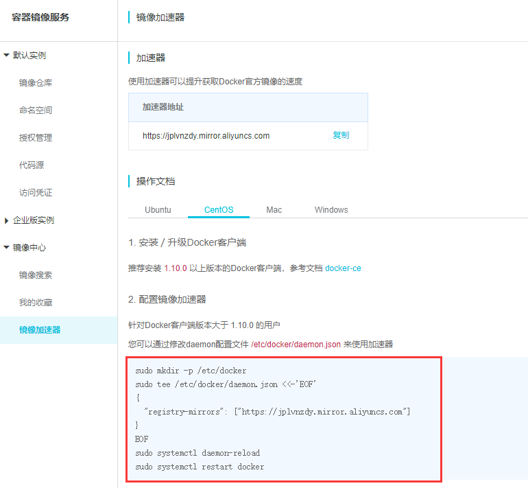

复制并执行。

更新缓存

```
sudo yum makecache fast
```

安装Docker

```
sudo yum install -y docker-ce docker-ce-cli containerd.io
```

启动Docker

```
sudo systemctl start docker
```

#### 利用image启动一个container

docker使用image（模版）来创建一个container（容器）

当我们的image在本地不存在的时候，会尝试去远端仓库去拉取一个image。

这里我们用一个docker官网的一个`hello-world`的例子来展示。

https://hub.docker.com/

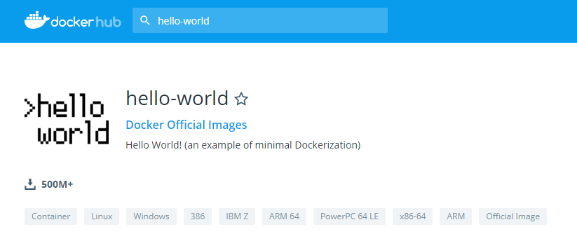

查看当前模版列表

```
docker images
```

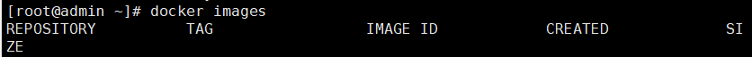

拉取 hello-world模版

```
docker pull hello-world
```


已经存在在模版中

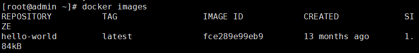

运行，你也可以为他取一个别名

```
docker run --name testhello hello-world
```

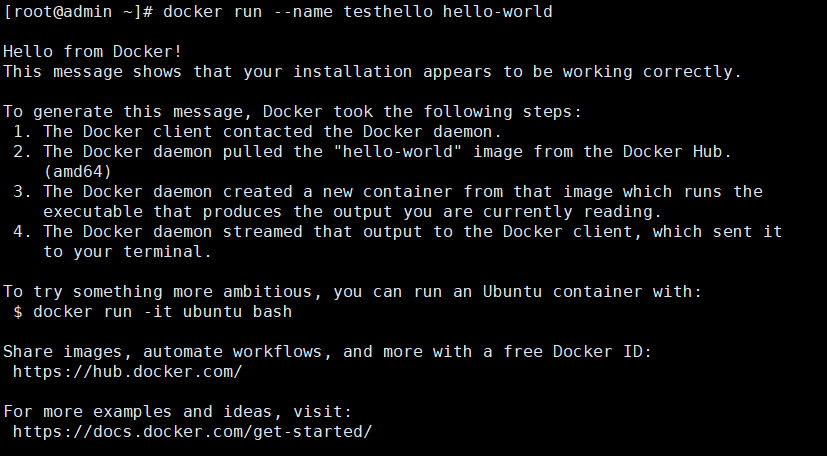

第一个例子运行完毕。

删除一个images

```
docker rmi -f hello-world
```

查询docker所以运行中的容器

```
docker ps
```

列出所有容器的id

```
docker ps -aq
```

停止docker中的所有运行中的容器

```
docker stop $(docker ps -aq)
```

停止docker中某一个运行中的容器

```
docker stop [容器的名字]
```

删除docker中所有的容器(未运行状态，必须是先停止，再删除)

```
docker rm -f $(docker ps -aq)
```

删除docker中指定名字的容器

```
docker rm [容器的名字]
```

删除所有images

```
docker rmi $(docker images -q)
```

进入一个容器中

```
docker exec -it [容器的名字] /bin/bash
```

从一个容器中退出

```
exit
```

重启docker

```
systemctl restart docker
```

#### 演示安装一个tomcat并启动

```
docker pull tomcat
```

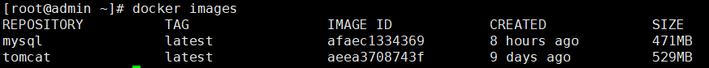

根据一个tomcat的images创建一个container，启动它

```
docker run -d(希望后台运行) --name tomcat01(别名) -p(映射到物理主机端口:服务需要映射的端口) tomcat
```

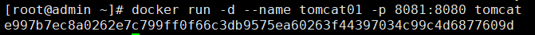

查看docker中正在运行的进程。

```
docker ps
```

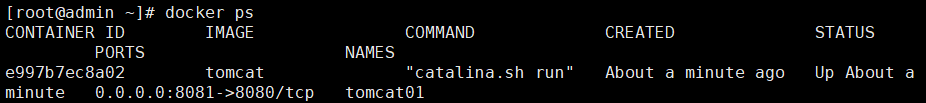

这台linux的物理ip地址为192.168.1.12，然后tomcat的8080端口被映射为了8081，所以此刻我们在浏览器上可以输入`192.168.1.12:8081`。

你也可以创建更多的tomcat的container

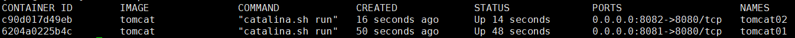

进入tomcat容器中。

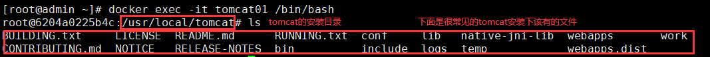

#### 安装 mysql

https://hub.docker.com/_/mysql

```
docker pull mysql
```

启动

```
docker run -d --name mysql01 -p 3301:3306 -e MYSQL_ROOT_PASSWORD=123456 --privileged mysql
```

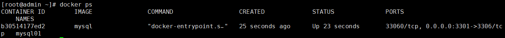

进入容器

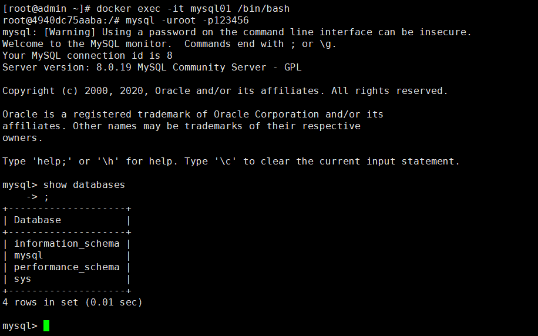

尝试用navicat连接

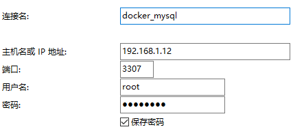

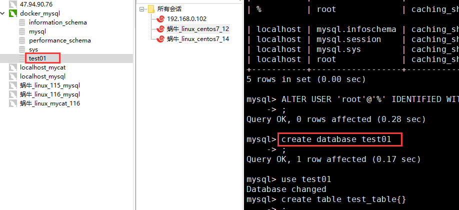

##### 关于连不上docker上的mysql的问题

一个是防火墙未关闭。

```
sudo systemctl stop firewalld
```

未开放某个端口

```
sudo firewall-cmd --add-port=3306/tcp  （放开3306的端口）
```

重新修改密码后用navicat登陆

```
ALTER USER 'root'@'%' IDENTIFIED WITH mysql_native_password BY 'newpassword'
```

#### Docker中的image是如何产生的

https://github.com/docker-library 官方image

https://github.com/docker-library/tomcat/blob/master/8.5/jdk8/openjdk/Dockerfifile msql路径

每个被Docker打包成image的文件下都存在一个文件叫做`Dockerfile`，这个文件记录了一些操作指令。

也就意味着，如何掌握了Dockerfile的语法，就可以自定义image。


image的概念可以理解为一层一层的其他程序组合起来的集合器，对于一个MySql Image而言，如果docker需要启动它的话，里面的会有一个linux的内核，当做一个最小粒度的平台，接着是centos的操作系统，然后是自己自定义的环境变量参数，还有一些其他的指令，这些会被Dockerfile按照编写的顺序一个一个的build成一个image。

我们可以自定义一个springboot项目，然后打包成image

第一步准备一个jar包。


然后在linux上随便创建一个文件夹

```
mkdir springboot-demo-image
```

然后cd到这个文件夹中，将jar包拷贝到这个文件夹下，接着就是创建一个Dockerfile文件去他构建成images。

> Dockerfile 常用的语法

* **FORM**

  * 指定基础镜像，比如FROM ubuntu:14.04

  * ```dockerfile
    FROM ubuntu:14.04
    ```

* **RUN**

  * 在镜像内部执行一些命令，比如安装软件，配置环境等，换行可以使用""

  * ```dockerfile
    RUN groupadd -r mysql && useradd -r -g mysql mysql
    ```

* **ENV**

  * 设置变量的值，ENV MYSQL_MAJOR 5.7，可以通过docker run --e key=value修改，后面可以直接使 

    用${MYSQL_MAJOR}

  * ```dockerfile
    ENV MYSQL_MAJOR 5.7
    ```

* **LABEL**

  * 设置镜像标签

  * ```dockerfile
    LABEL email="pop@163.com" 
    LABEL name="pop2016"
    ```

* **VOLUME**

  * 指定数据的挂在目录

  * ```dockerfile
    VOLUME /var/lib/mysql
    ```

* **COPY**

  * 将主机的文件复制到镜像内，如果目录不存在，会自动创建所需要的目录，注意只是复制，不会提取和 

    解压 

  * ```dockerfile
    COPY docker-entrypoint.sh /usr/local/bin/
    ```

*  **ADD**

  * 将主机的文件复制到镜像内，和COPY类似，只是ADD会对压缩文件提取和解压

  * ```dockerfile
    ADD application.yml /etc/itcrazy2016/
    ```

* **WORKDIR**

  * 指定镜像的工作目录，之后的命令都是基于此目录工作，若不存在则创建

  * ```dockerfile
    WORKDIR /usr/local 
    WORKDIR tomcat 
    #会在/usr/local/tomcat下创建test.txt文件
    RUN touch test.txt
    
    # 会在/root/test下多出一个app.yml文件
    WORKDIR /root 
    ADD app.yml test/
    ```

* **CMD**

  * 容器启动的时候默认会执行的命令，若有多个CMD命令，则最后一个生效

  * ```dockerfile
    CMD ["mysqld"] 
    或
    CMD mysqld
    ```

* **ENTRYPOINT**

  * 和CMD的使用类似

  * ```dockerfile
    ENTRYPOINT ["docker-entrypoint.sh"]
    ```

  * 和CMD的不同  docker run执行时，会覆盖CMD的命令，而ENTRYPOINT不会

* **EXPOSE**

  * 指定镜像要暴露的端口，启动镜像时，可以使用-p将该端口映射给宿主机

  * ```dockerfile
    EXPOSE 3306
    ```

创建一个部署自己springboot的dockfile

```dockerfile
FROM openjdk:8
# 由于springboot项目需要依赖java环境，所以需要引入这个环境，如果你没有安装，将会从仓库拉取
MAINTAINER pop
# 维护者
LABEL name="dockerfile-demo" version="1.0" author="jack"
# 指定名字，和版本和作者
COPY demo-0.0.1-SNAPSHOT.jar dockerfile-demo-image.jar
# 你需要将宿主主机上的资源，拷贝到dockerfile所在目录，也就是要拷贝到docker环境上进行image的buiild操作，在这里取一个别名，由于dockerfile和宿主资源jar包在同一个目录，所以就直接拷贝到当前目录了。
CMD ["java","-jar","dockerfile-demo-image.jar"]
# 这里执行的命令也就是启动jar包的命令
```


然后保存。接着开始构建image

```
docker build -t test-docker-image .
				(构建一个image的名字) 后面的 "."表示在当前目录，也就是Dockerfile所在的位置。
```


可以看到，他是按照我们的步骤进行操作的，image也被添加上去。

同样是可以成功运行


如何证明我们已经启动成功，首先可以通过查看日志。

```
docker logs [--name的别名]
```


第二个，是首先进入容器。

```
docker exec -it demo01 sh
```

然后用curl的命令，尝试去访问这个jar包中的接口是否可以正确返回。


你直接通过别的机器访问也可以，当时要注意端口请输入你映射到物理主机上的端口


#### 仓库的搭建

很明显，我们不希望每次都去外网去拉取镜像，因为太慢，所以我们可以使用阿里云或者本地仓库去搭建一些自己常用的镜像。

##### 阿里云仓库

https://cr.console.aliyun.com/cn-hangzhou/instances/repositories

首先你需要注册一个阿里云仓库，并开启仓库服务


然后再docker 登陆阿里云的账号。


```
sudo docker login --username=candierpop registry.cn-hangzhou.aliyuncs.com
```

`--username`是你的用户名，后面是固定写法


**需要注意的是这里的密码并不是你的账号密码，而是开通仓库的时候输入的密码**


将image推到自己的阿里云仓库。可以先生成一个**副本**。

```dockerfile
# docker tag [以哪个image为模版的名字] [副本的名字，后面的：v1.0表示版本号。]
docker tag test-docker-image candierpop/test-docker-image:v1.0
```


要推送到阿里云上，需要打上一定规则的tag，才可以上传成功。

```dockerfile
# docker tag 是固定写法，然后是以哪个image模版，后面也是 固定写法 registry.cn-hangzhou.aliyuncs.com/[阿里云创建好的命名空间]/[image名称，后来版本号]
sudo docker tag test-docker-image registry.cn-hangzhou.aliyuncs.com/docker_space01/test- docker-image:v1.0
```


开始上传。

```
sudo docker push registry.cn-hangzhou.aliyuncs.com/docker_space01/test-docker-image:v1.0
```


等待push完毕。


push完毕，然后去自己的仓库上看一看。


然后尝试删除掉本地的images，去阿里云拉取，然后运行，是否可以

```
 docker pull registry.cn-hangzhou.aliyuncs.com/docker_space01/test-docker-image:v1.0
```


```
docker run -d --name demo02 -p 9191:8080 registry.cn-hangzhou.aliyuncs.com/docker_space01/test-docker-image:v1.0

```


访问也是没问题的

##### 私有仓库

https://github.com/goharbor/harbor


下载完成后，解压。

```
tar -zvxf harbor-offline-installer-v1.7.1.tgz 
```

然后cd到目录下，修改一下配置文件。

```
vim harbor.cfg
```

```properties
hostname = 192.168.1.12
# 一般修改一个在哪里域名上运行，这里填写物理主机上的。
harbor_admin_password = Harbor12345
# 用户名 admin 密码是这个
```


数据将会被放在**根目录**，如果你的根目录没有这么大的空间，就需要修改。


还有很多，所以可以放在这里。

还需要docker-compose的支持。

`sh install.sh `

完成后，访问4040 端口。

#### Container

image可以变成Container，通过run命令

Container可不可以变成image

```
docker commit [某个现有的container名字] [新的名字]
```

有了这个，可以为容器添加很多自定义的工具，因为容器是可读可写的。

通过container和dockerfile生成image的优缺点

优点：container更快捷

缺点：dockerfile很多操作是可见的，dockerfile也方面排查问题。dockfile也是官方推荐的方法。

##### 限制 Container 所占用的资源

控制后就不会所占用内存和cpu资源就不会无限增长，最后卡死。

先启动一个container


查看container的状态

```
docker top demo01 #不专业
docker stats demo01 # 很专业
```


可以看到，由于内存没有进行限制，他的上显示2.7g，会无限上升。所以我们创建一个限制的container

`docker run -d --name demo02 --memory 100M --cpu-shares 10 -p 9191:8080 test-docker-image`

内存限制 100M，cpu在容器中的配比为10%也就是权重。

再次查看


```
docker rm -f $(docker ps -aq) 删除全部容器
```

