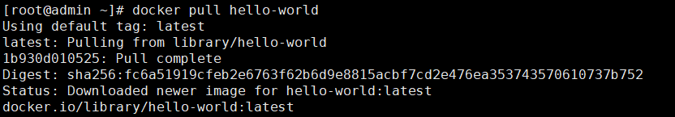
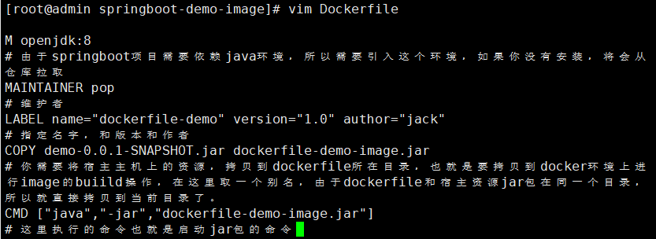
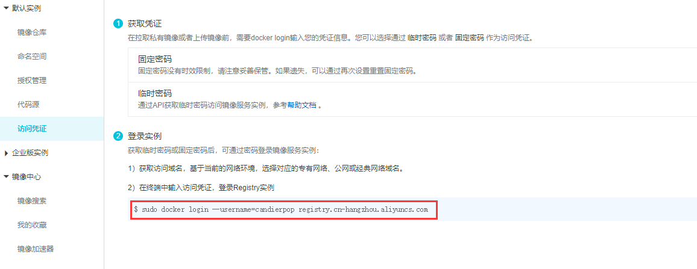
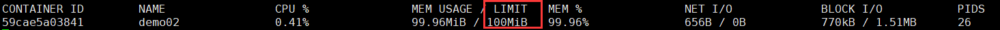

#### Docker

linux环境下的安装过程：https://docs.docker.com/install/linux/docker-ce/centos/

安装过程简述：

删除之前安装过的Docker文件

```
sudo yum remove docker \
                  docker-client \
                  docker-client-latest \
                  docker-common \
                  docker-latest \
                  docker-latest-logrotate \
                  docker-logrotate \
                  docker-engine
```

设置Docker的仓库，这里不建议设置成官网推荐的，而推荐使用aliyun。

安装工具依赖

```
sudo yum install -y yum-utils \
  device-mapper-persistent-data \
  lvm2
```

阿里云映射

```
sudo yum-config-manager --add-repo http://mirrors.aliyun.com/docker-ce/linux/centos/docker-ce.repo
```

同时配置阿里云加速器，登陆自己的阿里云账户https://cr.console.aliyun.com/cn-hangzhou/instances/mirrors


复制并执行。

更新缓存

```
sudo yum makecache fast
```

安装Docker

```
sudo yum install -y docker-ce docker-ce-cli containerd.io
```

启动Docker

```
sudo systemctl start docker
```

#### 利用image启动一个container

docker使用image（模版）来创建一个container（容器）

当我们的image在本地不存在的时候，会尝试去远端仓库去拉取一个image。

这里我们用一个docker官网的一个`hello-world`的例子来展示。

https://hub.docker.com/


查看当前模版列表

```
docker images
```


拉取 hello-world模版

```
docker pull hello-world
```



已经存在在模版中


运行，你也可以为他取一个别名

```
docker run --name testhello hello-world
```


第一个例子运行完毕。

删除一个images

```
docker rmi -f hello-world
```

查询docker所以运行中的容器

```
docker ps
```

列出所有容器的id

```
docker ps -aq
```

停止docker中的所有运行中的容器

```
docker stop $(docker ps -aq)
```

停止docker中某一个运行中的容器

```
docker stop [容器的名字]
```

删除docker中所有的容器(未运行状态，必须是先停止，再删除)

```
docker rm -f $(docker ps -aq)
```

删除docker中指定名字的容器

```
docker rm [容器的名字]
```

删除所有images

```
docker rmi $(docker images -q)
```

进入一个容器中

```
docker exec -it [容器的名字] /bin/bash
```

从一个容器中退出

```
exit
```

重启docker

```
systemctl restart docker
```

#### 演示安装一个tomcat并启动

```
docker pull tomcat
```


根据一个tomcat的images创建一个container，启动它

```
docker run -d(希望后台运行) --name tomcat01(别名) -p(映射到物理主机端口:服务需要映射的端口) tomcat
```


查看docker中正在运行的进程。

```
docker ps
```


这台linux的物理ip地址为192.168.1.12，然后tomcat的8080端口被映射为了8081，所以此刻我们在浏览器上可以输入`192.168.1.12:8081`。

你也可以创建更多的tomcat的container


进入tomcat容器中。


#### 安装 mysql

https://hub.docker.com/_/mysql

```
docker pull mysql
```

启动

```
docker run -d --name mysql01 -p 3301:3306 -e MYSQL_ROOT_PASSWORD=123456 --privileged mysql
```


进入容器


尝试用navicat连接


##### 关于连不上docker上的mysql的问题

一个是防火墙未关闭。

```
sudo systemctl stop firewalld
```

未开放某个端口

```
sudo firewall-cmd --add-port=3306/tcp  （放开3306的端口）
```

重新修改密码后用navicat登陆

```
ALTER USER 'root'@'%' IDENTIFIED WITH mysql_native_password BY 'newpassword'
```

#### Docker中的image是如何产生的

https://github.com/docker-library 官方image

https://github.com/docker-library/tomcat/blob/master/8.5/jdk8/openjdk/Dockerfifile msql路径

每个被Docker打包成image的文件下都存在一个文件叫做`Dockerfile`，这个文件记录了一些操作指令。

也就意味着，如何掌握了Dockerfile的语法，就可以自定义image。


image的概念可以理解为一层一层的其他程序组合起来的集合器，对于一个MySql Image而言，如果docker需要启动它的话，里面的会有一个linux的内核，当做一个最小粒度的平台，接着是centos的操作系统，然后是自己自定义的环境变量参数，还有一些其他的指令，这些会被Dockerfile按照编写的顺序一个一个的build成一个image。

我们可以自定义一个springboot项目，然后打包成image

第一步准备一个jar包。


然后在linux上随便创建一个文件夹

```
mkdir springboot-demo-image
```

然后cd到这个文件夹中，将jar包拷贝到这个文件夹下，接着就是创建一个Dockerfile文件去他构建成images。

> Dockerfile 常用的语法

* **FORM**

  * 指定基础镜像，比如FROM ubuntu:14.04

  * ```dockerfile
    FROM ubuntu:14.04
    ```

* **RUN**

  * 在镜像内部执行一些命令，比如安装软件，配置环境等，换行可以使用""

  * ```dockerfile
    RUN groupadd -r mysql && useradd -r -g mysql mysql
    ```

* **ENV**

  * 设置变量的值，ENV MYSQL_MAJOR 5.7，可以通过docker run --e key=value修改，后面可以直接使 

    用${MYSQL_MAJOR}

  * ```dockerfile
    ENV MYSQL_MAJOR 5.7
    ```

* **LABEL**

  * 设置镜像标签

  * ```dockerfile
    LABEL email="pop@163.com" 
    LABEL name="pop2016"
    ```

* **VOLUME**

  * 指定数据的挂在目录

  * ```dockerfile
    VOLUME /var/lib/mysql
    ```

* **COPY**

  * 将主机的文件复制到镜像内，如果目录不存在，会自动创建所需要的目录，注意只是复制，不会提取和 

    解压 

  * ```dockerfile
    COPY docker-entrypoint.sh /usr/local/bin/
    ```

*  **ADD**

  * 将主机的文件复制到镜像内，和COPY类似，只是ADD会对压缩文件提取和解压

  * ```dockerfile
    ADD application.yml /etc/itcrazy2016/
    ```

* **WORKDIR**

  * 指定镜像的工作目录，之后的命令都是基于此目录工作，若不存在则创建

  * ```dockerfile
    WORKDIR /usr/local 
    WORKDIR tomcat 
    #会在/usr/local/tomcat下创建test.txt文件
    RUN touch test.txt
    
    # 会在/root/test下多出一个app.yml文件
    WORKDIR /root 
    ADD app.yml test/
    ```

* **CMD**

  * 容器启动的时候默认会执行的命令，若有多个CMD命令，则最后一个生效

  * ```dockerfile
    CMD ["mysqld"] 
    或
    CMD mysqld
    ```

* **ENTRYPOINT**

  * 和CMD的使用类似

  * ```dockerfile
    ENTRYPOINT ["docker-entrypoint.sh"]
    ```

  * 和CMD的不同  docker run执行时，会覆盖CMD的命令，而ENTRYPOINT不会

* **EXPOSE**

  * 指定镜像要暴露的端口，启动镜像时，可以使用-p将该端口映射给宿主机

  * ```dockerfile
    EXPOSE 3306
    ```

创建一个部署自己springboot的dockfile

```dockerfile
FROM openjdk:8
# 由于springboot项目需要依赖java环境，所以需要引入这个环境，如果你没有安装，将会从仓库拉取
MAINTAINER pop
# 维护者
LABEL name="dockerfile-demo" version="1.0" author="jack"
# 指定名字，和版本和作者
COPY demo-0.0.1-SNAPSHOT.jar dockerfile-demo-image.jar
# 你需要将宿主主机上的资源，拷贝到dockerfile所在目录，也就是要拷贝到docker环境上进行image的buiild操作，在这里取一个别名，由于dockerfile和宿主资源jar包在同一个目录，所以就直接拷贝到当前目录了。
CMD ["java","-jar","dockerfile-demo-image.jar"]
# 这里执行的命令也就是启动jar包的命令
```



然后保存。接着开始构建image

```
docker build -t test-docker-image .
				(构建一个image的名字) 后面的 "."表示在当前目录，也就是Dockerfile所在的位置。
```


可以看到，他是按照我们的步骤进行操作的，image也被添加上去。

同样是可以成功运行


如何证明我们已经启动成功，首先可以通过查看日志。

```
docker logs [--name的别名]
```


第二个，是首先进入容器。

```
docker exec -it demo01 sh
```

然后用curl的命令，尝试去访问这个jar包中的接口是否可以正确返回。


你直接通过别的机器访问也可以，当时要注意端口请输入你映射到物理主机上的端口


#### 仓库的搭建

很明显，我们不希望每次都去外网去拉取镜像，因为太慢，所以我们可以使用阿里云或者本地仓库去搭建一些自己常用的镜像。

##### 阿里云仓库

https://cr.console.aliyun.com/cn-hangzhou/instances/repositories

首先你需要注册一个阿里云仓库，并开启仓库服务


然后再docker 登陆阿里云的账号。



```
sudo docker login --username=candierpop registry.cn-hangzhou.aliyuncs.com
```

`--username`是你的用户名，后面是固定写法


**需要注意的是这里的密码并不是你的账号密码，而是开通仓库的时候输入的密码**


将image推到自己的阿里云仓库。可以先生成一个**副本**。

```dockerfile
# docker tag [以哪个image为模版的名字] [副本的名字，后面的：v1.0表示版本号。]
docker tag test-docker-image candierpop/test-docker-image:v1.0
```


要推送到阿里云上，需要打上一定规则的tag，才可以上传成功。

```dockerfile
# docker tag 是固定写法，然后是以哪个image模版，后面也是 固定写法 registry.cn-hangzhou.aliyuncs.com/[阿里云创建好的命名空间]/[image名称，后来版本号]
sudo docker tag test-docker-image registry.cn-hangzhou.aliyuncs.com/docker_space01/test- docker-image:v1.0
```


开始上传。

```
sudo docker push registry.cn-hangzhou.aliyuncs.com/docker_space01/test-docker-image:v1.0
```


等待push完毕。


push完毕，然后去自己的仓库上看一看。


然后尝试删除掉本地的images，去阿里云拉取，然后运行，是否可以

```
 docker pull registry.cn-hangzhou.aliyuncs.com/docker_space01/test-docker-image:v1.0
```


```
docker run -d --name demo02 -p 9191:8080 registry.cn-hangzhou.aliyuncs.com/docker_space01/test-docker-image:v1.0

```


访问也是没问题的

##### 私有仓库

https://github.com/goharbor/harbor


下载完成后，解压。

```
tar -zvxf harbor-offline-installer-v1.7.1.tgz 
```

然后cd到目录下，修改一下配置文件。

```
vim harbor.cfg
```

```properties
hostname = 192.168.1.12
# 一般修改一个在哪里域名上运行，这里填写物理主机上的。
harbor_admin_password = Harbor12345
# 用户名 admin 密码是这个
```


数据将会被放在**根目录**，如果你的根目录没有这么大的空间，就需要修改。


还有很多，所以可以放在这里。

还需要docker-compose的支持。

`sh install.sh `

完成后，访问4040 端口。

#### Container

image可以变成Container，通过run命令

Container可不可以变成image

```
docker commit [某个现有的container名字] [新的名字]
```

有了这个，可以为容器添加很多自定义的工具，因为容器是可读可写的。

通过container和dockerfile生成image的优缺点

优点：container更快捷

缺点：dockerfile很多操作是可见的，dockerfile也方面排查问题。dockfile也是官方推荐的方法。

##### 限制 Container 所占用的资源

控制后就不会所占用内存和cpu资源就不会无限增长，最后卡死。

先启动一个container


查看container的状态

```
docker top demo01 #不专业
docker stats demo01 # 很专业
```


可以看到，由于内存没有进行限制，他的上显示2.7g，会无限上升。所以我们创建一个限制的container

`docker run -d --name demo02 --memory 100M --cpu-shares 10 -p 9191:8080 test-docker-image`

内存限制 100M，cpu在容器中的配比为10%也就是权重。

再次查看



```
docker rm -f $(docker ps -aq) 删除全部容器
```


#### 网络

在linux版本的docker engine下，每个根据image而创造出来的container都是一个小型的linux内核，则意味着每个container都可能是一个centos操作系统上装上了包含了container中东西的一个程序。

同时在docker中，每个容器都是可以互相通信的。当我们安装docker成功的时候，会发现我们会多出一张名字为docker0的网卡。


下面的`172.17.0.1`是docker中容器的局域网地址，lo是代表本地环路地址，一般是固定的，因为一个机器本身自己也可以成一个网络，eth0和eth1不固定，一个代表的是联络外网的网卡，也就是和外网通信的网卡，一个是物理机器局域网的网卡。

网卡作为机器通信的物理基础，也就代表了机器可以正常在网络通信的唯一证明，所以网卡所拥有的MAC地址是唯一的，和id唯一是同样的。

之前说了linux 版本的 docker engine中的container实际上是一个有一个的linux容器，那么为什么作为安装了docker的宿主linux会允许自己里面运行若干的linux机器，同时还可以拥有自己的网络呢。

原因在于linux中的`network namespace`技术，它可以将每一台linux系统进行隔离，操作系统和网络的隔离，所以才会允许这种多系统的运行。

而能够让他们彼此通信的则依赖了`veth pair（Virtual Ethernet Pair）`技术，这种技术会同时发放一对可以互相通信的网卡，然后你可以将它发放给需要通信两台机器，同时授予他们ip地址，并且开启网卡，这个时候就可以通信成功。

我们没有启动docker中任何容器前，网卡列表是这样的。


当我们启动一个docker容器的时候，在查看一下。


可以发现，下面多了一张网卡，而且命名也很奇怪，不过他的状态是**UP**开启的状态。

然后我们进入刚刚启动的容器看一看


可以发现后面的一个是if32一个是if33，这是veth技术创建一对网卡很好的证明，因为按照序号排列，他们是成对出现的，而且我们发现容器中的这个网卡的ip地址其实是存在于docker0的网段的。

我们可以再创建一个容器。


答案也很明显了。


这也说明了为什么在宿主主机上可以ping通容器。


是因为宿主主机上每次创建新的容器都会被分配新的veth peer网卡，那么为什么容器和容器可以彼此ping通，是因为他们在同一网段，有docker0作为桥梁。

##### 只用名字就能ping通网络。

在一个这样的场景中，例如一个springboot项目需要使用mysql数据库，springboot项目和mysql数据都准备做成image在docker上运行，但由于每次docker run的时候，ip地址是不固定的，所以希望如果把名字作为可以ping通的ip地址就好了，这样写配置文件的时候，就不用纠结数据库的ip地址写什么了。

这就需要创建我们自己的network

docker安装完成后，默认的network是docker0，也就是172.17.0.1这个网关。

创建自定义的network的两个好处

* 如果ip地址不够用了，可以再次创建出另一个网段的ip地址供给使用。
* 可以用名字就能ping通，不用考虑ip的变动。

查看现有的network网络列表。

```
docker network ls
```


第一个名字为bridge代表是docker0的网络，host代表的是物理主机的，也是宿主centos的网络，none只有一个本地地址，不能通信，存在理由也是未知的。

检查一下bridge

```
docker network inspect bridge
```

首先创建一个自己的network

```
docker network create test-net 
or
docker network create --subnet=172.18.0.0/24 test-net
```


同时我们的宿主主机也多了这样一项目。


而画图理解的话，就相当于这样。


这属于两个不同的网络了，虽然都属于桥接（bridge）。

接着就是将容器加入到新创建的网络中。

```
docker run -d --name demo01 --network test-net -p 9090:8080 test-docker-image
```

我们创建两个


前面我们知道彼此是处于同一网络中的容器是可以互相ping通的，宿主主机和容器也是可以ping通的，因为有veth peer技术的支持。

同时我们检查一个新创建的`172.18.0.1`中。

```json
[root@admin harbor]# docker network inspect test-net
[
    {
        "Name": "test-net",
        "Id": "9e88b9008f259140cd15cd4658e3291d7888cb8b143c393e6211328cb615456f",
        "Created": "2020-02-23T22:39:19.673058914+08:00",
        "Scope": "local",
        "Driver": "bridge",
        "EnableIPv6": false,
        "IPAM": {
            "Driver": "default",
            "Options": {},
            "Config": [
                {
                    "Subnet": "172.18.0.0/24"
                }
            ]
        },
        "Internal": false,
        "Attachable": false,
        "Ingress": false,
        "ConfigFrom": {
            "Network": ""
        },
        "ConfigOnly": false,
        "Containers": {
            "b4450357e30559c0f5e83cb69dd8e3ee666ad1498424a92e1846f3f1b41a2034": {
                "Name": "demo02",
                "EndpointID": "ba5e9c6876c4cd5c90e677d7770d4a6a115bba49d5ae173878e6cf716c6dbe8b",
                "MacAddress": "02:42:ac:12:00:03",
                "IPv4Address": "172.18.0.3/24",
                "IPv6Address": ""
            },
            "dc34021e7e7403c508538488d2c3f535d7018bcf722e0d1b85000cd11378f157": {
                # 两个container已经被添加成功。
                "Name": "demo01",
                "EndpointID": "de582d9c3ace2f4eef7814b605018cfc478468b1ab66c9fb29077d0750126077",
                "MacAddress": "02:42:ac:12:00:02",
                "IPv4Address": "172.18.0.2/24",
                "IPv6Address": ""
            }
        },
        "Options": {},
        "Labels": {}
    }
]

```

现在我们新创建了一个test-net网络，看看能否用名字去ping通。


我们发现是可以互相ping通的。

#### 关于容器的持久化存储

https://github.com/docker-library/mysql/blob/master/5.7/Dockerfile

例如mysql的持久化方案。


VOLUME关键字代表容器数据所挂载的位置，我们可以使用

```
docker volume ls
```

来查看当前docker中有多少这样的路径。


当我们启动一个mysql容器的时候

```
docker run -d --name mysql01 -e MYSQL_ROOT_PASSWORD=123456 mysql
```

就会多出这样一个值。


不过，如果你觉得这个名字不够好看，你也可以自己定义目录名字

```
docker run -d --name mysql02 -v mysql02_volume:/var/lib/mysql -e MYSQL_ROOT_PASSWORD=123456 mysql
```


这样可读性就好一点。

**同时也意味着，如果你的volume不去删除，将会永远存在物理主机上，同时也可以做数据的恢复。但是要指定路径**

##### tomcat 中的开发需要实施部署。

在docker中启动一个tomcat的时候，可以指定宿主路径和容器的路径进行匹配，这样在你修改的时候，就会同步更新。

```
docker run -d --name tomcat01 -v /tmp/[项目名字]:/var/lib/tomcat/webapps/[项目名字] -p 8081:8080 tomcat
```

这样当你修改宿主主机/tmp/[项目名字]文件的时候，就会同步更新

这就是docker 中的 **Bind Mounting**技术。

如果你想要在window系统上更新文件同步在docker容器中更新的话，那么你就需要看虚拟机之间是否有映射关系。

##### docker 中mysql强一致解决方案

```
docker pull percona/percona-xtradb-cluster:5.7.21
```

搭建的需要考虑的几个要素。

* 网络
  * 我们需要创建一个全新的网络(network)方便管理
  * 同时，新的网络可以使用名字ping通，也方便管理
* 存储
  * 我们需要预先创建好三个预设好的存储节点
* 如果启动
  * 启动这个image需要配置什么参数。

名字太长了，我们打个tag，用于修改名字。

```
docker tag percona/percona-xtradb-cluster:5.7.21 pxc
```

> 创建网络

```
docker network create --subnet=172.19.0.0/24 pxc-net
```


> 创建三个挂载节点目录

```
[root@admin _data]# docker volume create --name v1
v1
[root@admin _data]# docker volume create --name v2
v2
[root@admin _data]# docker volume create --name v3
v3
[root@admin _data]# docker volume ls
DRIVER              VOLUME NAME
local               mysql02_volume
local               v1
local               v2
local               v3
[root@admin _data]# docker volume inspect v1
```


> 启动容器

```
docker run -d -p 3301:3306 -v v1:/var/lib/mysql -e MYSQL_ROOT_PASSWORD=123456 -e CLUSTER_NAME=PXC -e XTRABACKUP_PASSWORD=123456 --privileged --name node1 --net=pxc-net --ip=172.19.0.2 pxc
```


之后增加的节点，需要增加 `-e CLUSTER_JOIN=node1`，表示要加入到哪个节点中，虽然是加入，但是其实只是一个加入的参照物而已，只要要加入的值是在那个分布式群里就行。

```dockerfile
# node2 的加入
docker run -d -p 3302:3306 -v v2:/var/lib/mysql -e MYSQL_ROOT_PASSWORD=123456 -e CLUSTER_NAME=PXC -e XTRABACKUP_PASSWORD=123456 --privileged -e CLUSTER_JOIN=node1  --name node2 --net=pxc-net --ip=172.19.0.3 pxc
# node3 的加入
docker run -d -p 3303:3306 -v v3:/var/lib/mysql -e MYSQL_ROOT_PASSWORD=123456 -e CLUSTER_NAME=PXC -e XTRABACKUP_PASSWORD=123456 --privileged -e CLUSTER_JOIN=node1  --name node3 --net=pxc-net --ip=172.19.0.4 pxc

```

```
docker run -d -p 3301:3306 -v v1:/var/lib/mysql -e MYSQL_ROOT_PASSWORD=jack123 -e CLUSTER_NAME=PXC -e XTRABACKUP_PASSWORD=jack123 --privileged --name=node1 --net=pxc-net --ip 172.19.0.2 pxc

docker run -d -p 3302:3306 -v v2:/var/lib/mysql -e MYSQL_ROOT_PASSWORD=jack123 -e CLUSTER_NAME=PXC -e XTRABACKUP_PASSWORD=jack123 -e CLUSTER_JOIN=node1 --privileged --name=node2 --net=pxc-net --ip 172.19.0.3 pxc

docker run -d -p 3303:3306 -v v3:/var/lib/mysql -e MYSQL_ROOT_PASSWORD=jack123 -e CLUSTER_NAME=PXC -e XTRABACKUP_PASSWORD=jack123 -e CLUSTER_JOIN=node1 --privileged --name=node3 --net=pxc-net --ip 172.19.0.4 pxc
```

##### springboot+nginx+mysql


* 第一步创建网络
* 第二部创建在位置

```
docker run -d--name my-mysql -v v1:/var/lib/mysql -p3301:3306 -eMYSQL_ROOT_PASSWORD=jack123 --net=pro-net --ip172.18.0.6 mysql

(1)在本地测试该项目的功能主要是修改application.yml文件中数据库的相关配置

(2)在项目根目录下执行mvn clean package打成一个jar包

[记得修改一下application.yml文件数据库配置]mvn clean package -Dmaven.test.skip=true在target下找到"springboot-mybatis-0.0.1-SNAPSHOT.jar.jar"

(3)在docker环境中新建一个目录"springboot-mybatis"

(4)上传"springboot-mybatis-0.0.1-SNAPSHOT.jar"到该目录下，并且在此目录创建Dockerfile

(5)编写Dockerfile内容FROM openjdk:8-jre-alpineMAINTAINER itcrazy2016    LABEL name="springboot-mybatis" version="1.0" author="itcrazy2016"COPY springboot-mybatis-0.0.1-SNAPSHOT.jar springboot-mybatis.jarCMD ["java","-jar","springboot-mybatis.jar"]

(6)基于Dockerfile构建镜像docker build -t sbm-image .

(7)基于image创建containerdocker run -d --name sb01 -p 8081:8080 --net=pro-net --ip 172.18.0.11 sbm-image

(8)查看启动日志docker logs sb01

(9)在win浏览器访问http://192.168.8.118:8081/user/listall
```

由于在一个网络中名字是可以ping通的，所以数据库地址还可以改成这样

```
url: jdbc:mysql://my-mysql/db_gupao_springboot?
```

> Nginx

(1)在centos的/tmp/nginx下新建nginx.conf文件，并进行相应的配置

```
user nginx;
worker_processes  1;
events {   
	worker_connections  1024;
}
http {    
	include       /etc/nginx/mime.types;
	default_type  application/octet-stream;    
	sendfile        on;    
	keepalive_timeout  65;    
	server {        
		listen 80;        
		location / {         
			proxy_pass http://balance;        
		}    
	}    
	upstream balance{          
		server 172.18.0.11:8080;        
		server 172.18.0.12:8080;        
		server 172.18.0.13:8080;    
	}    
	include /etc/nginx/conf.d/*.conf;
}
```

创建nginx容器

先在centos7上创建/tmp/nginx目录，并且创建nginx.conf文件，写上内容

```
docker run -d --name my-nginx -p 80:80 -v/tmp/nginx/nginx.conf:/etc/nginx/nginx.conf --network=pro-net --ip 172.18.0.10 nginx
```


#### 安装docker-compose

https://docs.docker.com/compose/install/

首先，如果你再Mac环境和Window环境下安装了docker，那么dockercompose就已经默认安装完成了。


linux安装步骤

```dockerfile
# 1
sudo curl -L "https://github.com/docker/compose/releases/download/1.25.4/docker-compose-$(uname -s)-$(uname -m)" -o /usr/local/bin/docker-compose
# 2
sudo chmod +x /usr/local/bin/docker-compose
# 3
sudo ln -s /usr/local/bin/docker-compose /usr/bin/docker-compose
```

`docker-compose.yml`

```yml
version: '3' # 版本号，一般固定
services: # 表示下面会有多个 container
  web:		# container的名字
    build: .	# 表示这个image还不存在，且需要dockerfile构建，这个时候dockerfile文件存在于当前目录
    ports:		# 指定端口
      - "5000:5000"
  redis:	# container的名字	
    image: "redis:alpine"	# 表示从远程仓库拉取
    networks:
    	- app-net # 表示使用哪个网络
    	
networks: # 创建网络
	app-net:
		driver: bridge
```

在存在docker-compose.yaml文件的位置执行命令,默认找当前目录的docker-compose.yaml

```
docker-compose up -f docker-compose.yaml -d
```

文件中指定的container将会启动完成

#### Docker Swarm

docker-compose是单机管理容器的解决方案，那么Docker Swarm就是多机的解决方案。

将多台安装了docker的机器，组成一个集群，共同给外界提供服务，并且可以很好管理多个容器。

docker swarm在安装完docker后就自带了。

```
docker swarm
```


首先你需要三台机器，然后确定ip地址。

```dockerfile
# 选择一个作为Leader,这条命令执行后，会出现一条命令，主要切换到其他机器分别执行就好了
docker swarm init --advertise-addr=192.168.0.2
# 查看当前swarm集群的个数
docker node ls

```

添加完成后，可以在某个机器上输入这样一个来表示创建一个容器

```dockerfile
docker service create --name my-tomcat tomcat

docker service ls

# 扩容，scale命令，按照某一个已经启动好的容器，再创建若干个和这个容器一样的容器你
docker service scale my-tomcat=3
# 再创建三个
```

多机之间通信，需要创建overlay的网络

```
docker network create -d overlay overlay-net
```

启动的时候，带上这个网络即可

```
docker service create --name my-tomcat tomcat --network overlay-net
```

**不过请保证，其它三台机器的ip请不要相同**。

集群中的任何机器访问，都可以访问到docker service create创建的容器。

也就是类似复杂均衡的隔绝在中间，会分发请求。