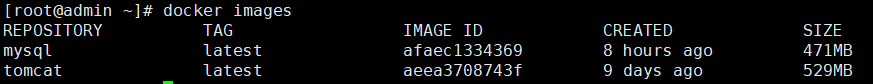
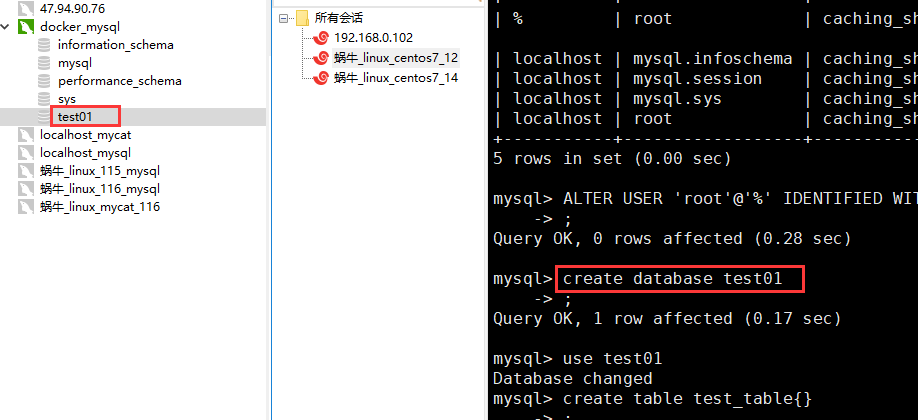

#### Docker

linux环境下的安装过程：https://docs.docker.com/install/linux/docker-ce/centos/

安装过程简述：

删除之前安装过的Docker文件

```
sudo yum remove docker \
                  docker-client \
                  docker-client-latest \
                  docker-common \
                  docker-latest \
                  docker-latest-logrotate \
                  docker-logrotate \
                  docker-engine
```

设置Docker的仓库，这里不建议设置成官网推荐的，而推荐使用aliyun。

安装工具依赖

```
sudo yum install -y yum-utils \
  device-mapper-persistent-data \
  lvm2
```

阿里云映射

```
sudo yum-config-manager --add-repo http://mirrors.aliyun.com/docker-ce/linux/centos/docker-ce.repo
```

同时配置阿里云加速器，登陆自己的阿里云账户https://cr.console.aliyun.com/cn-hangzhou/instances/mirrors


复制并执行。

更新缓存

```
sudo yum makecache fast
```

安装Docker

```
sudo yum install -y docker-ce docker-ce-cli containerd.io
```

启动Docker

```
sudo systemctl start docker
```

#### 利用image启动一个container

docker使用image（模版）来创建一个container（容器）

当我们的image在本地不存在的时候，会尝试去远端仓库去拉取一个image。

这里我们用一个docker官网的一个`hello-world`的例子来展示。

https://hub.docker.com/


查看当前模版列表

```
docker images
```


拉取 hello-world模版

```
docker pull hello-world
```


已经存在在模版中


运行，你也可以为他取一个别名

```
docker run --name testhello hello-world
```


第一个例子运行完毕。

删除一个images

```
docker rmi -f hello-world
```

查询docker所以运行中的容器

```
docker ps
```

列出所有容器的id

```
docker ps -aq
```

停止docker中的所有运行中的容器

```
docker stop $(docker ps -aq)
```

停止docker中某一个运行中的容器

```
docker stop [容器的名字]
```

删除docker中所有的容器(未运行状态，必须是先停止，再删除)

```
docker rm $(docker ps -aq)
```

删除docker中指定名字的容器

```
docker rm [容器的名字]
```

删除所有images

```
docker rmi $(docker images -q)
```

进入一个容器中

```
docker exec -it [容器的名字] /bin/bash
```

从一个容器中退出

```
exit
```

重启docker

```
systemctl restart docker
```

#### 演示安装一个tomcat并启动

```
docker pull tomcat
```



根据一个tomcat的images创建一个container，启动它

```
docker run -d(希望后台运行) --name tomcat01(别名) -p(映射到物理主机端口:服务需要映射的端口) tomcat
```


查看docker中正在运行的进程。

```
docker ps
```


这台linux的物理ip地址为192.168.1.12，然后tomcat的8080端口被映射为了8081，所以此刻我们在浏览器上可以输入`192.168.1.12:8081`。

你也可以创建更多的tomcat的container


进入tomcat容器中。


#### 安装 mysql

https://hub.docker.com/_/mysql

```
docker pull mysql
```

启动

```
docker run -d --name mysql01 -p 3301:3306 -e MYSQL_ROOT_PASSWORD=123456 --privileged mysql
```


进入容器


尝试用navicat连接




##### 关于连不上docker上的mysql的问题

一个是防火墙未关闭。

```
sudo systemctl stop firewalld
```

未开放某个端口

```
sudo firewall-cmd --add-port=3306/tcp  （放开3306的端口）
```

重新修改密码后用navicat登陆

```
ALTER USER 'root'@'%' IDENTIFIED WITH mysql_native_password BY 'newpassword'
```

